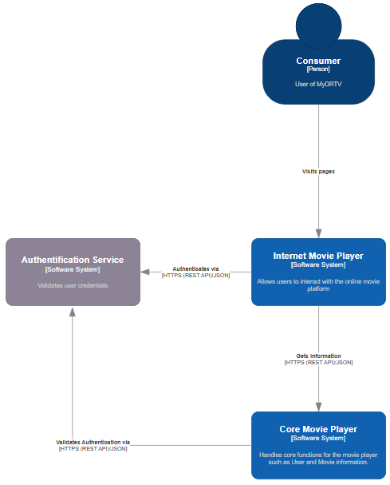

Vi har valgt en lagdelt arkitekturstil (Layered Architecture), da den balancerer enkelhed, omkostninger og funktionalitet godt til dette projekt. Nedenfor forklares systemets flow og arkitekturvalget med refleksion over ratings fra "Software Architecture Patterns" af Mark Richards.

## C4 Model

Systemet er struktureret efter C4-modellen for at visualisere kontekst, containere og komponenter. I system kontekst diagrammet interagerer forbrugeren (Consumer) med Internet Movie Player, som er den primære softwarekomponent. Forbrugeren besøger sider via browseren, hvorefter Internet Movie Player autentificerer via en ekstern Authentication Service over HTTPS. Derefter henter den information fra Core Movie Player via HTTP, mens Core Movie Player validerer autentificeringen via samme service. Dette sikrer sikker adgang til data som film, metadata og brugerinformation.

I container diagrammet for Internet Movie Player leverer Static Content (HTML, CSS, JavaScript) indhold til UI + Backend (baseret på C# Blazor), som er en single-page app. Forbrugeren interagerer med UI + Backend, der håndterer autentificering og henter data fra Core Movie Player. Ved login genereres en JWT-token, der bruges til sikre API-kald. Dette reducerer kobling og muliggør modulært design.

Core Movie Players container diagram viser Backend (C#) som central komponent, der håndterer anmodninger fra Internet Movie Player. Backend validerer JWT via Authentication Service og læser/skriver til databaser:

- Movie Database (AWS S3 for filmfiler)
- Movie Metadata Database (MongoDB for kommentarer og info)
- User Database (PostgreSQL for brugerdata, inklusive ratings)

Dette følger Domain-Driven Design med bounded contexts, hvor hver database mapper til et domæneansvar, som brugervalidering og indholdsretrieval.

I komponentdiagrammet for UI + Backend i Internet Movie Player består systemet af sider som Main Page, All Movies Page, Movie Page og User Page (alle C# Blazor-komponenter), der bruger APICaller til at kalde Core Movie Player. APICaller håndterer API-kald og sikrer, at data som filmratings hentes sikkert. Autentificering integreres via login-flow, der henter JWT.

For Backend i Core Movie Player håndterer APIHandler anmodninger og validerer via Authentication Service. Den bruger database forbindelses klasser til at hente data fra de respektive databaser og returnere svar. Dette sikrer høj tilgængelighed ved at isolere fejl og understøtte skalering af databaser individuelt.

Samlet set flyder systemet sådan: Forbrugeren logger ind via Internet Movie Player, der autentificerer og henter JWT. Derefter foretages API-kald til Core Movie Player, der validerer og leverer data fra databaser. Dette understøtter features som søgning, ratings og anbefalinger, mens GDPR sikres via sikker datahåndtering i User Database.

## Arkitekturvalg og Refleksion

Vi har valgt en lagdelt arkitekturstil (Layered Architecture), da systemet naturligt opdeles i præsentationslag (Internet Movie Player), forretningslag (Core Movie Player Backend) og datalag (databaser). Dette matcher DDD-principper med bounded contexts for brugere, metadata og indhold, hvilket reducerer kobling og fremmer modulært design.

Reflekterende over ratingsoversigten (Figur A-1 fra bogen): Layered har "T" i partitioning (horisontal), hvilket passer til vores opdeling i lag for enklere vedligehold. Samlet omkostning er lav ($), ideel for et projekt der finansieres af staten. Agility er lav (•), hvilket er fint fordi det ikke behøver ændres meget efter udvikling, mens simplicity er høj (•••••), da lagene er intuitive og reducerer kompleksitet sammenlignet med mere distribuerede stilarter.

Sammenlignet med alternativer: Microservices har høj skalering (•••••) og fault tolerance (•••••), men høj omkostning ($$$$$) og lav simplicity (•), hvilket ville øge udviklingstid og budget. Event-Driven er agil (•••), men kræver mere kompleksitet for events som ratings-opdateringer, og omkostning ($$$) er højere end Layered. Microkernel kunne passe med Core som kerne, men vores design er mere lagdelt end plugin-baseret. Space-Based er for dyr ($$$$$) og overkill for vores belastning.

Fordele ved Layered: Lav indgangsbarriere, god fault isolation inden for lag, og understøtter høj tilgængelighed via replikering af databaser. Ulemper: Lavere skalering (•) og extensibility (•), men dette kan adresseres med cloud-skalering (AWS). Valget prioriterer enkelhed og omkostninger, mens det opfylder krav om tilgængelighed og brugerinteraktion.
