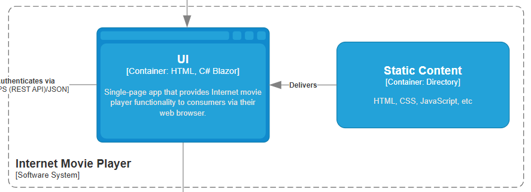

# Indledning

MyDRTV er en videospiller og socialt netværk udviklet for den danske statslige broadcaster for at promovere dansk TV og film globalt. Systemet giver adgang til en stor samling af gamle TV-programmer, inklusive brugerprofiler med ratings, søgefunktioner baseret på år, titel, genre mv. Høj tilgængelighed er et krav, og der er fokus på brugerinteraktion via ratings og anbefalinger. Systemet er del af en digital transformation, der inkluderer markedsføring, GDPR-overholdelse og forbedret brugerengagement.

# Teknologivalg

MyDRTVs teknologivalg fokuserer på at skabe en skalerbar, vedligeholdelsesvenlig og omkostningseffektiv løsning for den danske statslige broadcaster. Systemet skal håndtere høj tilgængelighed, brugerinteraktion og GDPR-overholdelse, mens det promoverer dansk TV og film globalt.

## Framework Valg: Blazor Server

Blazor Server er valgt som primært frontend framework, da det passer flere centrale behov samtidigt og tilbyder en sammenhængende udviklingsoplevelse. Ved at skrive både frontend og backend logik i C# elimineres behovet for separate JavaScript frameworks, hvilket reducerer kodekompleksitet og udviklingsomkostninger markant.

Det innovative ved Blazor Server ligger i håndteringen af realtidsopdateringer via SignalR-forbindelser, som etablerer persistente websocket-forbindelser mellem klient og server. Når brugere kommenterer eller giver ratings, propageres ændringer instantly til alle aktive sessioner, hvilket skaber en levende brugeroplevelse der matcher moderne streaming-platforme.

Komplekse interaktioner som dynamisk søgning og intelligent watchlist-håndtering implementeres rent server-side uden JavaScript-afhængigheder. Dette demonstreres i `MovieDetails.razor` komponentet, hvor sofistikeret data-binding og event-handling skaber seamless brugerinteraktioner.

Denne "layered" tilgang øger både sikkerhed gennem server-side logik-ekskvering og udviklingseffektivitet via unified C# kodebasis, selvom kravet om konstant server-forbindelse introducerer minimal netværks-latency - dette menes dog at være acceptabelt for danske brugere med stabil internetinfrastruktur.

## Programmeringssprog: C# og .NET 8

C# og .NET 8 platformen blev strategisk valgt for deres enterprise-grade performance og avancerede sikkerhedsfeatures, hvilket er kritisk for en statslig broadcaster med høje krav til stabilitet. Teknologikombinationen leverer robust runtime-performance samtidig med moderne udviklingspraksis gennem omfattende tooling-økosystem.

Systemarkitekturen anvender dependency injection til løs kobling mellem komponenter, hvilket letter unit testing og fremtidig refaktorering. Domænemodeller som AppUser, Movie og Comment udnytter C#s compile-time type-safety til at garantere data-integritet under udviklingsprocessen. Samtidig implementeres konsekvent async/await pattern gennem service-laget, hvilket sikrer optimal skalerbarhed under peak-belastning.

.NET 8 blev bevidst prioriteret over nyere versioner grundet dens long-term support status, hvilket garanterer sikkerhedsopdateringer over en minimum 3-årig periode - strategisk vigtigt for offentlige projekter med langsigtede driftshorisonter.

## Database Strategi: Polyglot Persistence

MyDRTV implementerer en polyglot persistence tilgang med tre specialiserede databaser, hver optimeret til specifikke behov:

Arkitekturen viser MyDRTV-systemet som centralt hub med HTTPS API-forbindelser til hver database. PostgreSQL håndterer brugerdata med GDPR-fokus, MongoDB administrerer fleksible filmmetadata, mens AWS S3 leverer global videodistribution via CloudFront CDN.

### PostgreSQL til Brugerdata

PostgreSQL blev strategisk valgt til brugerdatabasen grundet dens industrielt gennemprøvede ACID-compliance egenskaber og omfattende sikkerhedsfeature-suite, som er fundamentalt afgørende for stringent GDPR-overholdelse i europæiske sammenhænge. Databasens sofistikerede row-level security mekanismer og native krypteringsfunktioner beskytter sensitive personlige data som brugernavne, fødselsdatoer og adresseinformationer med military-grade sikkerhed.

Samtidig sikrer PostgreSQLs robuste relationelle constraints system meticulous data-integritet på tværs af komplekse relationer mellem user ratings, film preferences og social interactions, hvilket garanterer konsistent dataqualitet under alle omstændigheder.

### MongoDB til Metadata

MongoDB håndterer filmmetadata, da denne naturligt passer til dokumentstrukturer. Filmdata som cast-lister, undertekster og anmeldelser varierer i skemaer, hvilket MongoDBs fleksible document-model understøtter uden tidskrævende schema-migrations. Comments og ratings gemmes som embedded documents for optimeret læsehastighed.

### AWS S3 til Filmfiler

AWS S3 leverer skalerbar, omkostningseffektiv storage med global distribution. Systemet udnytter forskellige storage classes, hvor populære film opbevares i Standard Storage for hurtig adgang, mens ældre indhold arkiveres billigere i Glacier Storage - kritisk for offentlige budgetbegrænsninger.

Diagrammet illustrerer storage-strategien med opdeling mellem Standard Storage for nyere udgivelser og Glacier Storage for arkivindhold. CloudFront CDN distribuerer globalt til edge locations som USA, London og Tyskland, hvilket balancerer performance og omkostninger effektivt.

## Sikkerhed og Performance

Blazor Servers inherente server-side arkitektur etablerer et robust sikkerhedslag ved at holde kritisk forretningslogik og sensitive algoritmer fuldstændig isoleret fra klient-miljøet. Denne tilgang eliminerer potentielle vector attacks og code inspection vulnerabilities, som typisk eksisterer i client-side JavaScript frameworks.

Mens den nuværende prototype anvender simplified FakeAuthService til demonstration, vil produktionsimplementeringen deploye industriel-standard JWT-tokens integreret med comprehensive claims-based authorization policies. APICaller.cs-komponenten fungerer strategisk som architectural facade mellem presentation og business lag, hvilket faciliterer seamless integration af avancerede sikkerhedsmekanismer som granular authorization matrices og intelligent rate limiting algoritmer.

Systemets defensive programming approach implementerer multi-layered datavalidering gennem både client-side Blazor input komponenter og server-side validation i CoreMoviePlayer servicelaget, hvilket etablerer redundant data-integritet checkpoints gennem hele request-response lifecycle.

## Skalering og Fremtidige Overvejelser

Den teknologiske stack understøtter både vertikal og horisontal skalering gennem .NET 8s performance-forbedringer og native AOT compilation. Skaleringsstrategien omfatter database-replikering, partitionering og cloud-baseret auto-skalering, hvilket sikrer håndtering af stigende brugerantal og datamængder.

# Arkitekturvalg

Vi har valgt en lagdelt arkitekturstil (Layered Architecture), da den balancerer enkelhed, omkostninger og funktionalitet godt til dette projekt. Nedenfor forklares systemets flow og arkitekturvalget med refleksion over ratings fra "Software Architecture Patterns" af Mark Richards.

## C4 Model

Systemet er struktureret efter C4-modellen for at visualisere kontekst, containere og komponenter. I system kontekst diagrammet interagerer forbrugeren (Consumer) med Internet Movie Player, som er den primære softwarekomponent. Forbrugeren besøger sider via browseren, hvorefter Internet Movie Player autentificerer via en ekstern Authentication Service over HTTPS. Derefter henter den information fra Core Movie Player via HTTP, mens Core Movie Player validerer autentificeringen via samme service. Dette sikrer sikker adgang til data som film, metadata og brugerinformation.

I container diagrammet for Internet Movie Player leverer Static Content (HTML, CSS, JavaScript) indhold til UI + Backend (baseret på C# Blazor), som er en single-page app. Forbrugeren interagerer med UI + Backend, der håndterer autentificering og henter data fra Core Movie Player. Ved login genereres en JWT-token, der bruges til sikre API-kald. Dette reducerer kobling og muliggør modulært design.

Core Movie Players container diagram viser Backend (C#) som central komponent, der håndterer anmodninger fra Internet Movie Player. Backend validerer JWT via Authentication Service og gennem C# moduler bliver der læst/skrevet til databaser:

- Movie Database (AWS S3 for filmfiler)
- Movie Metadata Database (MongoDB for kommentarer og info)
- User Database (PostgreSQL for brugerdata, inklusive ratings)

Dette følger Domain-Driven Design med bounded contexts, hvor hver database mapper til et domæneansvar, som brugervalidering og indholdsretrieval.

Samlet set flyder systemet sådan: Forbrugeren logger ind via Internet Movie Player, der autentificerer og henter JWT. Derefter foretages API-kald til Core Movie Player, der validerer og leverer data fra databaser. Dette understøtter features som søgning, ratings og anbefalinger, mens GDPR sikres via sikker datahåndtering i User Database.

## Arkitekturvalg og Refleksion

Vi har valgt en lagdelt arkitekturstil (Layered Architecture), da systemet naturligt opdeles i præsentationslag (Internet Movie Player), forretningslag (Core Movie Player Backend) og datalag (databaser). Dette matcher DDD-principper med bounded contexts for brugere, metadata og indhold, hvilket reducerer kobling og fremmer modulært design.

Reflekterende over ratingsoversigten (Figur A-1 fra bogen): Layered har "T" i partitioning (horisontal), hvilket passer til vores opdeling i lag for enklere vedligehold. Samlet omkostning er lav ($), ideel for et projekt der finansieres af staten. Agility er lav (•), hvilket er fint fordi det ikke behøver ændres meget efter udvikling, mens simplicity er høj (•••••), da lagene er intuitive og reducerer kompleksitet sammenlignet med mere distribuerede stilarter.

Sammenlignet med alternativer: Microservices har høj skalering (•••••) og fault tolerance (•••••), men høj omkostning ($$$$$) og lav simplicity (•), hvilket ville øge udviklingstid og budget. Event-Driven er agil (•••), men kræver mere kompleksitet for events som ratings-opdateringer, og omkostning ($$$) er højere end Layered. Microkernel kunne passe med Core som kerne, men vores design er mere lagdelt end plugin-baseret. Space-Based er for dyr ($$$$$) og overkill for vores belastning.

Fordele ved Layered: Lav indgangsbarriere, god fault isolation inden for lag, og understøtter høj tilgængelighed via replikering af databaser. Ulemper: Lavere skalering (•) og extensibility (•), men dette kan adresseres med cloud-skalering (AWS). Valget prioriterer enkelhed og omkostninger, mens det opfylder krav om tilgængelighed og brugerinteraktion.

# Konklusion

Teknologivalgene balancerer udviklingshastighed, omkostningseffektivitet og fremtidig skalerbarhed. Blazor Server minimerer udviklerkompleksitet mens enterprise-grade sikkerhed opretholdes. Den polyglotte database-tilgang optimerer hver datatype individuelt, og C# som primærsprog sikrer vedligeholdelig, type-safe kode.

Denne stack understøtter MyDRTVs mission om global promotion af dansk indhold ved at levere en moderne, responsiv og sikker streaming-platform konkurrencedygtig med kommercielle alternativer.

Layered Architecture er optimal for MyDRTV, da det balancerer kravene med lav omkostning og høj simplicity. Prototypen demonstrerer flowet lokalt, og fremtidig skalering kan håndteres via cloud. Dette sikrer alignment med business-domænet via DDD.
