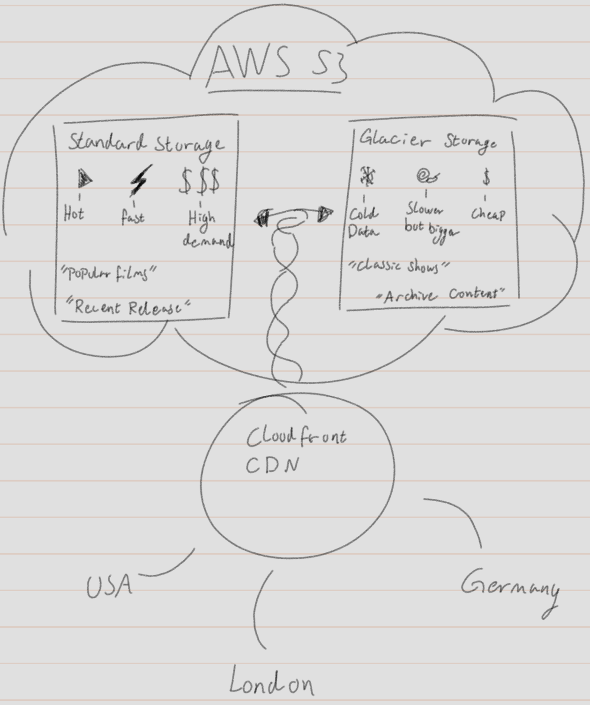

# Teknologi Afsnit

MyDRTVs teknologivalg er baseret på behovet for at skabe en skalerbar, vedligeholdelsesvenlig og omkostningseffektiv løsning til den danske statslige broadcaster. Systemet skal håndtere høj tilgængelighed, brugerinteraktion og GDPR-overholdelse, mens det promoverer dansk TV og film globalt.

## Framework Valg: Blazor Server vs. Razor Pages

Vi har valgt Blazor Server som vores primære frontend framework frem for traditionelle Razor Pages. Dette valg er strategisk begrundet i flere faktorer:

Blazor Server giver os mulighed for at skrive både frontend og backend logik i C#, hvilket reducerer kodekompleksitet og udviklingsomkostninger betydeligt. I modsætning til Razor Pages, der kræver JavaScript til interaktive elementer, håndterer Blazor Server real-time opdateringer via SignalR-forbindelser. Dette er særligt værdifuldt for MyDRTVs sociale funktioner som comments og ratings, hvor brugere får øjeblikkelige opdateringer når andre interagerer med indhold.

Komplekse interactions som søgning, rating-opdateringer og watchlist-håndtering kan implementeres rent server-side uden JavaScript. Dette ses i MovieDetails.razor, hvor rating og comment-systemet fungerer seamless med data-binding og event-handling.

Blazor Server reducerer udviklingstid, øger sikkerheden da business logic kører server-side, og muliggør real-time funktionalitet via SignalR. Ulempen er krav om konstant server-forbindelse og latency ved hver interaction, hvilket dog er acceptabelt for danske brugere.
### cause i said so? xd måske den lige skal renskrives den her ^

## Programmeringssprog: C# og .NET 8

C# er valgt som primærsprog baseret på flere strategiske overvejelser. .NET 8 platformen giver enterprise-grade performance og sikkerhed, som er kritisk for en statslig broadcaster.

Dependency injection bruges til løs kobling mellem komponenter, hvilket understøtter testbarhed og fremtidig refaktorering. Modeller som AppUser, Movie og Comment udnytter C#s type-safety til at sikre data-integritet på compile-time. Async/await pattern anvendes konsekvent i services, hvilket sikrer skalerbarhed når systemet håndterer mange samtidige brugere.

### Hvorfor ikke .NET 9?
Den er godt nok nyere, men har en standard support, mens at .NET 8 har en long-term support hvilket sikrer at vores produkt kan være så stabilt som muligt uden at kræve fremtidige opdateringer.

## Database Strategi: Polyglot Persistence

Vi implementerer en polyglot persistence tilgang med tre forskellige databaser, hver optimeret til specifikke use cases:

Figuren viser MyDRTVs database-arkitektur med tre specialiserede databaser. I centrum ses MyDRTV-systemet som et hub, hvorfra der går forbindelser til hver database via HTTPS API-kald. PostgreSQL håndterer user-data med fokus på GDPR-compliance og ACID-transaktioner. MongoDB administrerer fleksible metadata og kommentarer med dokument-baseret struktur. AWS S3 leverer global video-distribution med CloudFront CDN og omkostningsoptimeret storage.

### PostgreSQL til Brugerdata
PostgreSQL er valgt til User Database på grund af ACID-compliance og robuste sikkerhedsfeatures, som er afgørende for GDPR-overholdelse. Brugerdata kræver stærk konsistens - når en bruger opdaterer sin profil, skal ændringer være atomic og durable.

PostgreSQLs row-level security og indbyggede krypteringsmuligheder gør det ideelt til håndtering af personlige data som navne, fødselsdatoer og adresser. Relationelle constraints sikrer data-integritet på tværs af ratings og bruger-relationer.

### MongoDB til Metadata
MongoDB håndterer Movie Metadata Database, da filmmetadata naturligt passer til dokumentstrukturer. En film kan have variable felter som cast-lister, multiple sprog, undertekster og anmeldelser med forskellige skemaer.

MongoDBs fleksible document-model gør det nemt at tilføje nye metadata-typer uden schema-migrations. Film-comments og ratings kan gemmes som embedded documents for hurtig læsning, hvilket optimerer user experience ved filmvisning.

JSON-struktur i prototypen simulerer denne tilgang, hvor komplekse nested objects håndteres naturligt.

### AWS S3 til Filmfiler
AWS S3 er valgt til Movie Database (filmfilerne selv) da det giver skalerbar, omkostningseffektiv storage med global CDN-distribution. Danske film skal kunne streames til brugere på tværs af kontinenter med lav latency.

S3s forskellige storage classes (Standard, Glacier) tillader os at optimere omkostninger - populære film opbevares i Standard for hurtig adgang, mens ældre indhold kan arkiveres billigere i Glacier. Dette er kritisk for en statslig organisation med budgetbegrænsninger.

Figuren viser AWS S3 storage-strategien for MyDRTV. Øverst ses S3-clouden, som indeholder to hovedbokse: Standard Storage til populære og nyligt udgivne film, og Glacier Storage til klassiske shows og arkivindhold. 

- Standard Storage: Stærkest til film der ofte kaldes eller ses, eller nye udgivelser der forventes at være et hit.
- Glacier storage: Bedst til ældre indhold der sjældent tilgås, men som stadig skal opbevares af juridiske eller historiske årsager, eller grundet tilbagevendende seere.

Det handler om at sikrer tilgængelighed, mens vi prioriterer populære film lidt mere ift. hastighed. Diagrammet fremhæver hvordan systemet balancerer performance og omkostninger via S3s storage classes og global distribution.

## Sikkerhed og Performance

Blazor Servers server-side model giver inherent sikkerhed da business logic aldrig eksponeres til klienten. Authentication håndteres via FakeAuthService i prototypen, men vil udvides til JWT-tokens med claims-based authorization.

APICaller.cs fungerer som facade mellem frontend og backend, hvilket implementerer separation of concerns og gør det nemt at tilføje authorization-lag og rate limiting fremover. Heraf gøres det tydeligt at vi bruger layered architecture for at adskille forskellige ansvarsområder.

Data-validering sker både client-side via Blazors InputText og InputDate komponenter og server-side i CoreMoviePlayer, hvilket sikrer robust data-integritet.

## Skalering og Fremtidige Overvejelser

Vores teknologiske stack understøtter både vertikal og horisontal skalering. .NET 8s performance-forbedringer og native AOT compilation kan reducere memory footprint når trafikken stiger.

Skaleringsstrategien for MyDRTV kan illustreres med et simpelt diagram, der viser systemets evne til at håndtere flere brugere og større datamængder gennem database-replikering, partitionering og cloud-baseret auto-skalering.
### But do we do this?? or too much?

## Konklusion

Vores teknologivalg balancerer udviklingshastighed, omkostningseffektivitet og fremtidig skalerbarhed. Blazor Server reducerer udviklerkompleksitet samtidig med at enterprise-grade sikkerhed opretholdes. Den polyglotte database-tilgang optimerer hver data-type individuelt, og C# som primærsprog sikrer vedligeholdelig, type-safe kode.

Denne stack understøtter MyDRTVs mission om at promovere dansk indhold globalt ved at levere en moderne, responsiv og sikker streaming-platform der kan konkurrere med kommercielle alternativer.
